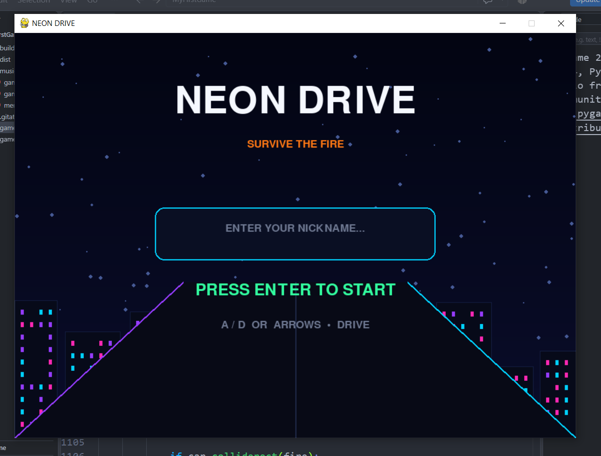
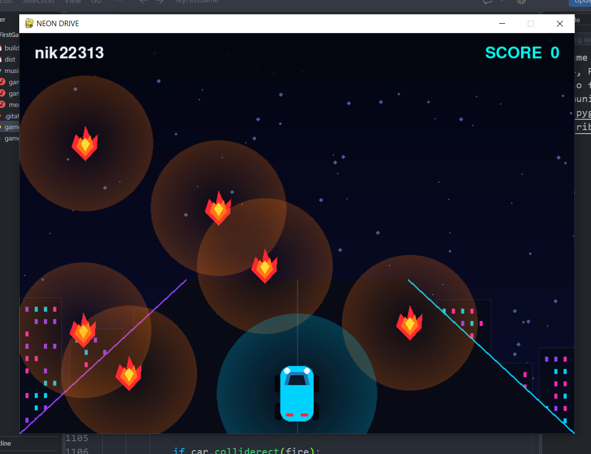

# 🎮 MyFirstGame

My first game created with Python and Pygame.

## 🕹️ About the game

A simple 2D game where the player controls a character and avoids falling enemies.

## 🛠️ Technologies

- Python
- Pygame
- Git
- GitHub

## 🎯 Features

- Player movement
- Falling enemies
- Collision detection
- Score system
- Game over system

## 👨‍💻 Author

Dmytro Surov
  ## 📸 Screenshots

## ▶️ How to run

1. Install Python 3.13 or newer.
2. Install Pygame:
   `pip install pygame`
3. Download this repository.
4. Open the project folder.
5. Run:
   `python game.py`
